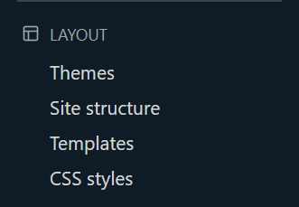
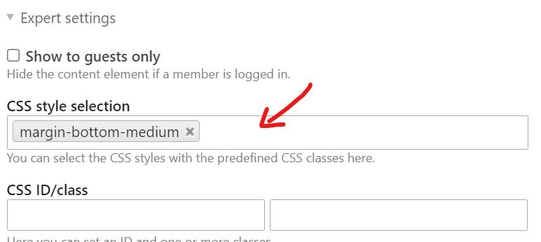

CSS Style Selector Bundle
=======================
This extension allows backend users to use predefined styles in articles, news, content elements, and many more. It's easy to use because it uses clear names for every style. The selected styles are then set to their corresponding CSS class, which can be styled as usual. It's really helpful if you want to set up a simple system for the end-user.

### CSS styles can be defined here



### The predefined styles can be selected here




Installation
------------

### Download the Bundle

Open a command console, enter your project directory and execute the
following command to download the latest stable version of this bundle:

```bash
$ composer require markocupic/contao-css-style-selector
```
